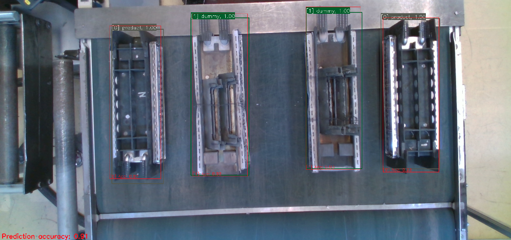

# label_tools_intersection_over_union
- Build an executable file
  ```
  $ mkdir build && cd build
  $ cmake ..
  $ make
  ```
- Run the executable file
  ```
  $ cd build
  $ ./intersection_over_union --config ../config/iou.yaml
  ```
  
- Terminal outputs
```
 Reading file: ../config/iou.yaml
 Successfully read params: iou/image_root
 Successfully set filetype: .png
Reading a file config/meta.data
Test image filename: features/test.txt
 |-- test_file: features/test.txt
 |-- test_file_prefix: features/
Name: 2021-02-14-12-15-15_0008.png	(Size: 1920x1080)
Name: 2021-02-14-11-42-44_0019.png	(Size: 1920x1080)
Name: 2021-02-14-11-42-44_0005.png	(Size: 1920x1080)
Name: 2021-02-14-12-15-15_0010.png	(Size: 1920x1080)
.
.
.
 |-- test_images: 38 images
 Successfully read params: iou/meta_data_file
 |-- annotations_file: features/features.names
 |-- classnames: [product] [dummy] [no_jig] 
 Successfully read params: iou/meta_data_file
 Loading YOLO model
 |-- weights: features/weights/yolov3-tiny_features_final.weights
 |-- cfg: features/yolov3-tiny_features.cfg
 |-- net size: 416 x 416
 |-- confidence threshold: 0.500000
 |-- nms threshold: 0.300000
 Successfully read params: iou/meta_data_file
 [0] 2021-02-14-12-15-15_0008.png
    Detection elapsed: 125.687 ms
    Accuracy: 0.911

----------------------------
Total accuracy of this model: 0.91082

  ```
